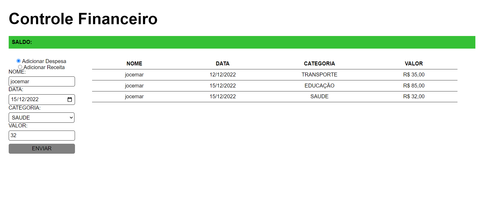

# Estudo Javascript;

## Pagina web para Controle Financeiro.
A intenção deste projeto é desenvolver uma aplicação web para controle financeiro básico ,isto é, uma pagina estruturada em HTML, estilizada com Css e usando linguagem Javascript ,para criar uma tabela com nome/descrição, data, categoria, e valor que são preenchidos pelo usuário.

Como meus conhecimentos em programação são básicos, tenho me dedicado a aprender mais sobre javascript afim de alterar ou simplificar a forma como vou escrevendo o código. Tenho aprendido  javascript através de cursos no youtube, grupos no discord e paginas web como w3school ,  freecodecamp , sendo assim **cintasse a vontade para dar dicas de como posso melhorar.**

### Momento atual do projeto:

Atualmente a pagina esta como mostrado na imagem abaixo:

### Principais desafios até o momento:
Como mencionei, estou aprendendo a programar em Javascript, já tenho compreensão sobre variáveis e seus escopos assim como funções e inclusão de parâmetros nas mesmas, mas passei por alguns problemas ao criar o evento (*addEventListener*) assim como apesar de compreender o que é um objeto em javascrip sinto dificuldades de escrever isso num código e "buscar" esses parâmetros em outros momentos.

## Atualizações:

 - [x] Estilizar a pagina.
 - [X] Criar formulario para adicionar despesas.
 - [x] Capturar dados do formulário de depesa.
 - [X] Criar formulario para adicionar receita.
 - [x] Capturar dados do formulário de receita.
 - [ ] Armazenar dados de despesas e receitas (*array*)?
 - [ ] Somar valores de despesa e receitas.
 - [x] Adicionar cor a tabela para vizualizar se é receita ou despesa.
 - [ ] Validar dados do formulário.
 - [ ] Subtrair despesas do saldo.
 - [ ] Opção de apagar linha da tabela.
 - [ ] Criar *Select* para Subcategoria.
 - [ ] Armazenar dados no navegador  usando *LocalStorage*.
 - [ ] Criar *select* para ver despesas por categoria/período. 

# Quer me ajudar? 
Minhas duvidas para próximas atualizações:

 - Criar *arrays* para armazenar dados de despesas é uma opção valida?
 - Como posso criar o *select* para subcategoria? Estou pensando em usar *while* , alterando o *style = display : none / block* .
